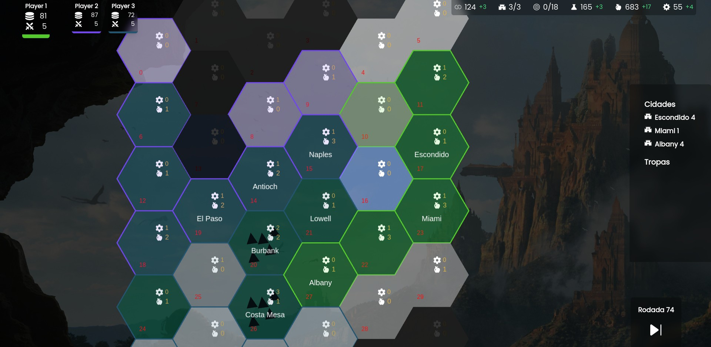
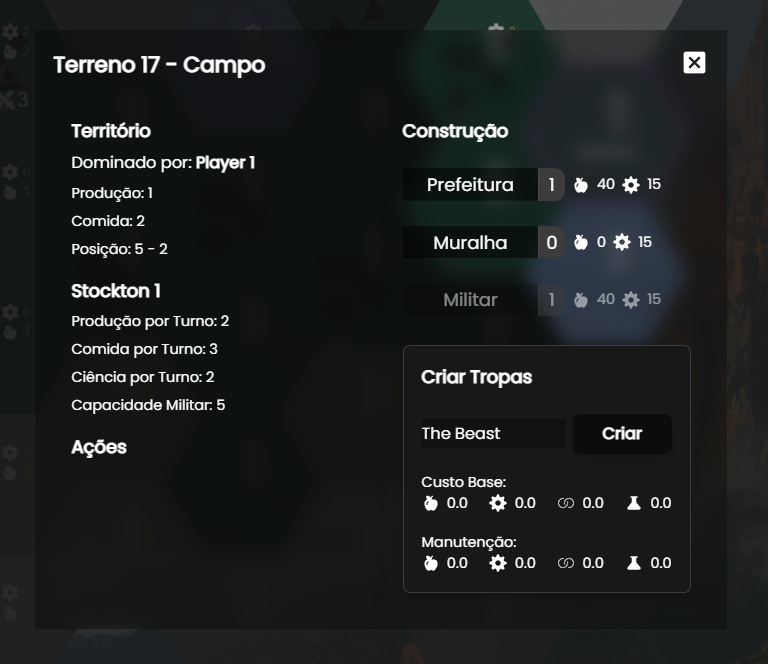
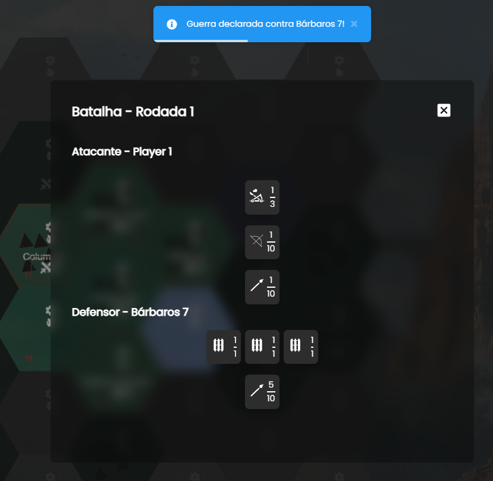

# History

A 4X Strategy Game in Web Browser with Pixi.js v6, Vite 3.x and Vue 3.x. Only for study.

## Cycle

- Turn based to Events -> IA Factors -> IA Actions -> Player Actions -> Next Round;
- Watch tracking in out of turn.

## Terrain

- Hex based with default terrain type settings;
- Graphic Hex -> Territory Owner Hex -> Fog Hex.

## ESM

- Only **Vue Pinia** statement values.

## IA

- Factor + Heuristic Best Case Choice.

## Troops

- Ikariam-style War;
- Groups in hex-to-hex;
- Count + line-type based.